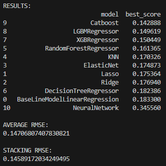

# House Price ML project

Machine Learning project for Kaggle House Prices competition.
The project includes preprocessing, feature engineering,
ensemble learning, boosting models, and a PyTorch neural network.

## Kaggle Competition

[Kaggle Competition](https://www.kaggle.com/c/house-prices-advanced-regression-techniques)

## Features

- Feature engineering
- Ensemble learning
- Stacking
- Cross-validation
- PyTorch neural network
- Kaggle submission pipeline

## Leaderboard



- Base model - LinearRegression (best_score - 0.183300)

## Structure of project

- data - this folder contains house data and a file with the final prediction.
    - submission.csv - the prediction file.
    - train.csv - initial training data.
    - test.csv - a file for predicting the best model.

- models - this folder contains files with machine learning, ensemble learning, and deep learning models.
    - ensemble.py - implementation of ensembles.
    **AVERAGE RMSE: 0.14952170716971036 | STACKING RMSE: 0.14648952763092035**
    - models_nn.py - deep learning model.
    - train_nn.py - implementation of the deep learning model training and prediction process.
    - train.py - machine learning model learning and prediction.

- prepocessing - this folder contains files with data processing.
    - feature_engineering.py - creating new features
    - preprocess.py - data preprocessing.

- utils - this folder contains files for loading the source data and the final prediction on the best model model using best_score.
    - load_data.py - uploading source data and receiving new features.
    - submit.py - generates final predictions using the best model.
    **the best model by best_score was CatBoostRegressor (best_score = 0.142888)**

- config.py - the file contains data on the distribution of features by type, basic training parameters, and a set of machine learning models.

- main.py - the main program launch file.

- requirements.txt - file with the main libraries used in this project.

## Models

- Linear Models
    - Lasso
    - Ridge
    - ElasticNet

- Tree Models
    - DecisionTreeRegressor
    - RandomForestRegressor

- Boosting Models
    - XGBoost
    - LightGBM
    - CatBoost

- Deep Learning
    - PyTorch MLP with embeddings

## Guide to launching the program on your device

### 1. Creating and activating the environment.

```bash
python -m venv venv
```

### Windows

```bash
venv\Scripts\activate
```

### Mac/Linux

```bash
source venv/bin/activate
```

### 2. Installing dependencies from a file requirements.txt

```bash
pip install -r requirements.txt
```

### 3. Run the main file "main.py" and get the prediction "submission.csv", it will be saved in the folder "data/"

```bash
python main.py
```
